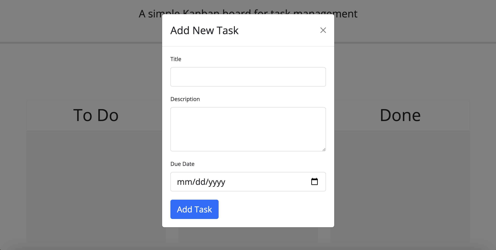

# To Do Board

## Description

My motivation to create this project was to make a to do board with an easy to read user interface to help keep track of tasks. I built this project to help myself and others get projects done on time. This site solves the problem of not having a to do board to write down projects and keep track of when they are due. I learned dynamic new ways to use jQuery.

## Deployed Site

The deployed website can be reached at the following link.

https://stefanfilm.github.io/ToDoBoard/

## Installation

To install the project, pull the code from https://github.com/stefanfilm/ToDoBoard and open it in a code editor. Open the script.js in the code editor and view the JavaScript. You could open the index.html file in a browser to see the code function.

## Usage

To use the website, click the green Add Task button. A modal will open with instructions to add a title, description, and due date. Enter info into those fields. Click the blue Add Task button. The card will show up on the To Do column. You could then drag the card to the In Progress or Done column when appropriate. The card will be yellow if it is due on the day you post it and it will be red if it is overdue. 

    ```md
    
    ```

## Credits

I worked on this project under the instruction of Mark Carlson in the UC Berkeley Software Developer Bootcamp.

## License

The license is an MIT license. Please refer to the GitHub Repository for details on the license. 

## Badges


